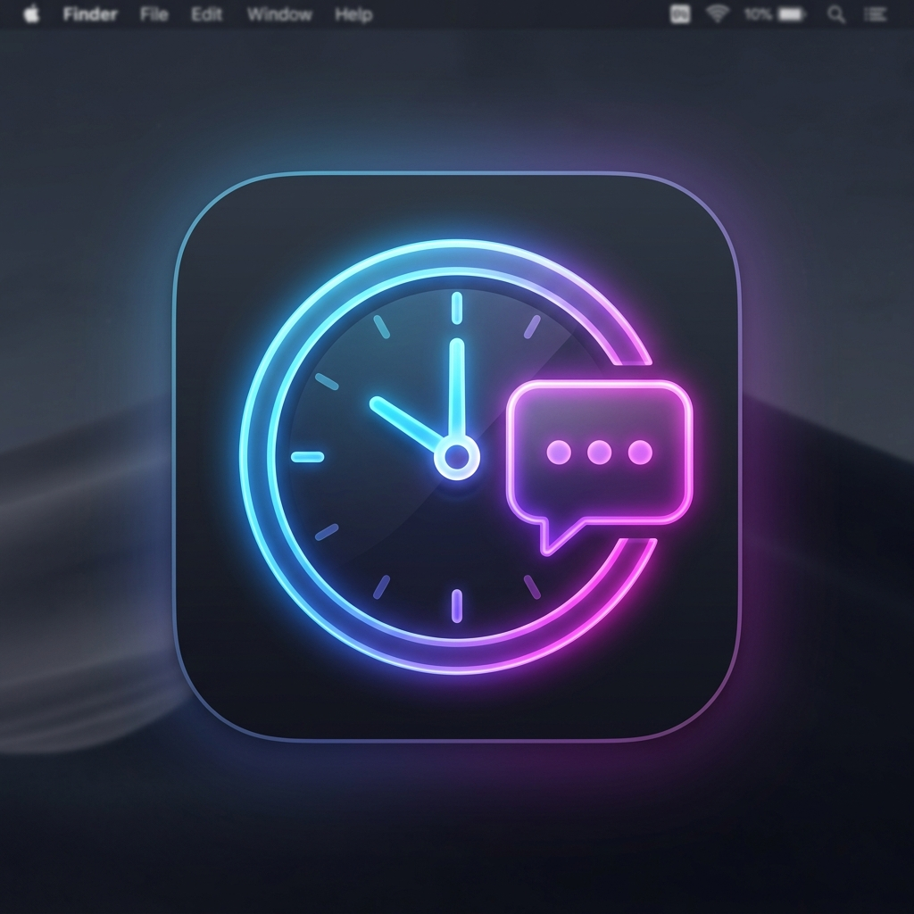

# 🕒 Timesheet Alert Comments

<p align="center">
  
</p>

<p align="center">
  <strong>Stay on top of your timesheets with awesome periodic alerts, seamless commenting, and screenshot attachments!</strong>
</p>

<p align="center">
  <a href="https://josmanvis.github.io/timesheet-alert-comments/">View Documentation</a>
</p>

## ✨ Features
- **Periodic Alerts**: Never forget to log your time again.
- **Easy Commenting**: Add context and notes to your time logs effortlessly.
- **Auto Screenshots**: Captures your screen exactly when the alert triggers for better context!
- **Markdown Logs**: Easily parseable single-file or per-entry logs.

## 🚀 Installation

### 🍺 Homebrew
```bash
brew install josmanvis/timesheet-alert-comments/timesheet-alert-comments
```

### 💻 cURL (Quick Install)
```bash
curl -sL https://raw.githubusercontent.com/josmanvis/timesheet-alert-comments/main/install.sh | bash
```

### 📦 Manual Download
You can download the `.dmg` or `.pkg` files directly from the [Releases](https://github.com/josmanvis/timesheet-alert-comments/releases) page.

---
*Built with ❤️ for productivity.*
